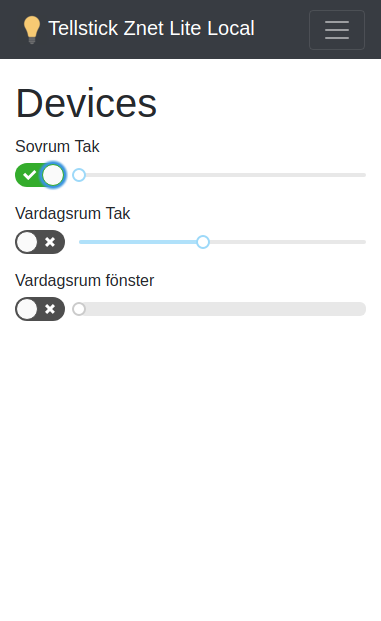
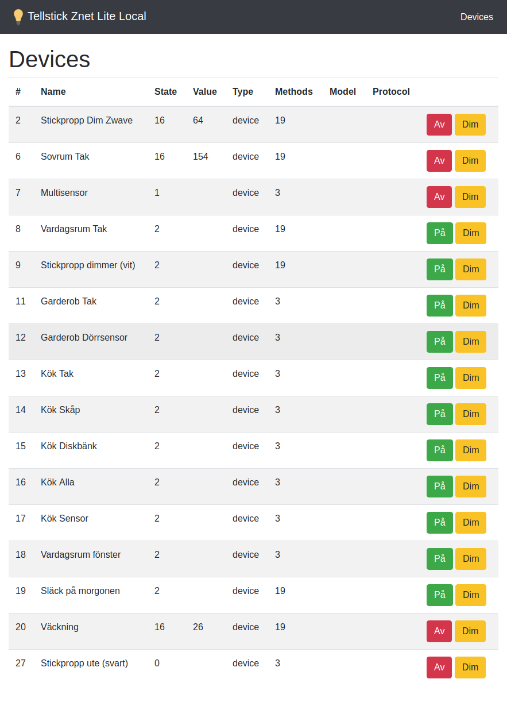

Tellstick Znet Lite local is a web client that let you control your Tellstick devices locally, without an internet connection.

Tellstick is an IOT gateway that I use to control the lights in my apartment. It can be controlled by Tellstick's mobile/web client thru the service Tellstick Live. Unfortunately it won't work if my internet connection is down. To make sure I can handle my lights independent on internal I maid a local client ([Tellstick Znet Lite Local Client](https://github.com/ropaolle/tellstick-znet-lite-local)) and a proxy/api ([Tellstick Znet Lite Local Proxy/Api](https://github.com/ropaolle/tellstick-znet-lite-local-api)) that talks to the Tellstick.

### Codebeat

[](https://travis-ci.org/ropaolle/tellstick-znet-lite-local)
[](https://codebeat.co/projects/github-com-ropaolle-tellstick-znet-lite-local-master)
[](https://www.codacy.com/app/ropaolle/tellstick-znet-lite-local?utm_source=github.com&utm_medium=referral&utm_content=ropaolle/tellstick-znet-lite-local&utm_campaign=Badge_Grade)
[](https://david-dm.org/ropaolle/tellstick-znet-lite-local)
[](https://david-dm.org/ropaolle/tellstick-znet-lite-local#info=devDependencies&view=list)
[](https://snyk.io/test/github/ropaolle/tellstick-znet-lite-local?targetFile=package.json)





## Start App/Api

```bash
# App
service nginx start/status
# Api
cd /home/olle/tellstick-znet-lite-local-api/src && pm2 start server.js
# pm2 status
```

## Nginx

* [Info](https://medium.com/@johnbrett/create-react-app-push-state-nginx-config-a9f7530621c1)

```bash
sudo apt-get install nginx
sudo nano /etc/nginx/sites-available/default

# Default server configuration
server {
  listen 80 default_server;
  listen [::]:80 default_server;
  server_name 192.168.10.146;

  root /home/olle/tellstick-znet-lite-local/build;

  # Routes without file extension e.g. /user/1
  location / {
    try_files $uri /index.html;
  }

  # 404 if a file is requested (so the main app isn't served)
  location ~ ^.+\..+$ {
    try_files $uri =404;
  }
}

sudo service nginx start
```

## Install

```bash
# Clone
git clone git@github.com:ropaolle/tellstick-znet-lite-local.git
cd tellstick-znet-lite-local
npm i
npm run build

# Pull
git stach
git pull origin master

# Force overwrite of local file with what's it origin repo
git fetch
git reset --hard origin/master
```

## Todo

* [x] Change the telldusCommand parameter list
* [x] Save favorites
* [x] Command shall always be a query string
* [x] Add sensors
* [x] Fix tests
* [ ] Validate commands in routes
* [ ] VS Code filehandlers: https://code.visualstudio.com/docs/setup/linux#_error-enospc

'/api/v1/favorites/{id}',
'/api/v1/init',
'/api/v1/token'
'/api/v1/{type}/{id?}', devices
