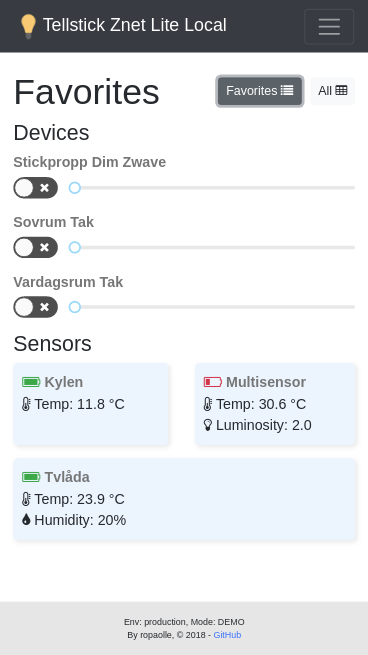
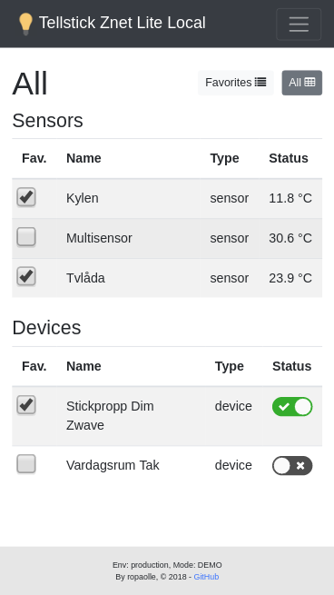

Tellstick Znet Lite local is a web client that let you control your Tellstick devices locally, without an internet connection.

Demo page: [https://ropaolle.github.io/tellstick-znet-lite-local/](https://ropaolle.github.io/tellstick-znet-lite-local/)

Tellstick is an IOT gateway that I use to control the lights in my apartment. It can be controlled by Tellstick's mobile/web client thru the service Tellstick Live. Unfortunately it won't work if my internet connection is down. To make sure I can handle my lights independent on internal I maid a local client ([Tellstick Znet Lite Local Client](https://github.com/ropaolle/tellstick-znet-lite-local)) and a proxy/api ([Tellstick Znet Lite Local Proxy/Api](https://github.com/ropaolle/tellstick-znet-lite-local/tree/api)) that talks to the Tellstick.

### Codebeat

 
